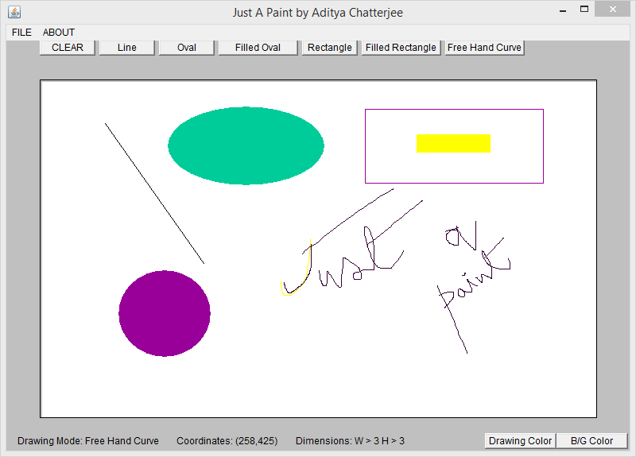
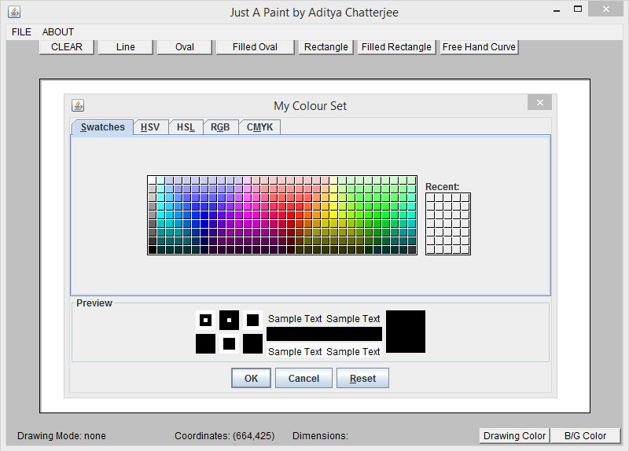
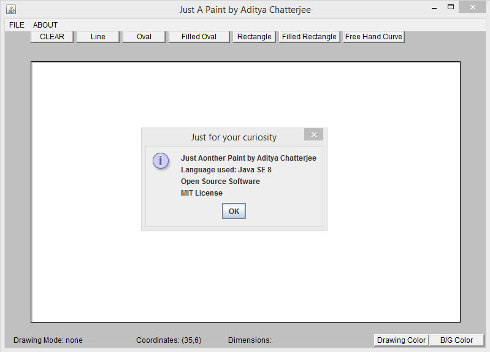

# Just A Paint
This is the Java version of the Paint applilication of Windows 
Author: Aditya Chatterjee 
Language used : Java SE 8 
Main code : painter3.java ( 3rd major modification of the code ) 
3 preview of my code : 
 
 
 
For supported platform, consult : http://docs.oracle.com/cd/E19830-01/819-4707/abqae/index.html 
Feel free to modify code by a pull request 
Suggest modifications at your will 
